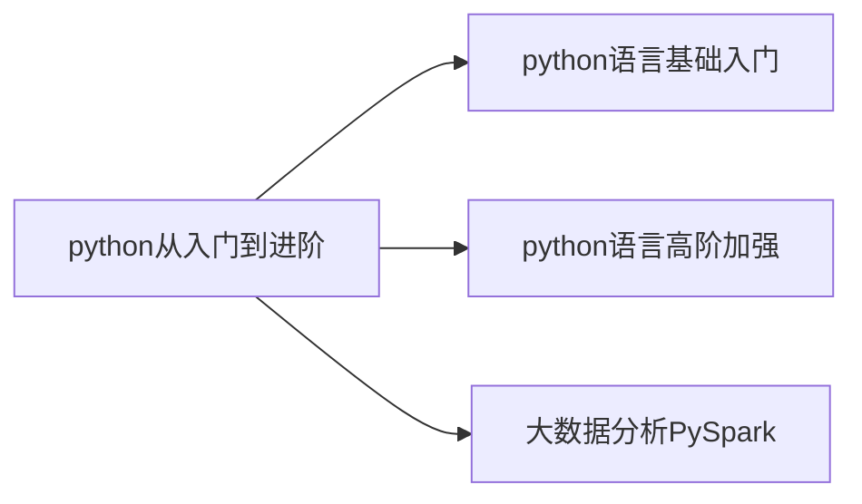

# python从入门到进阶

python从入门到进阶。
python简洁高效、应用场景丰富。

<!-- more -->




# 第一章 你好python
## 01 初始python
&ensp;&ensp;&ensp;&ensp;为什么选择python？
&ensp;&ensp;&ensp;&ensp;&ensp;&ensp;&ensp;&ensp;优雅、易学、开发效率高

## 02 什么是编程语言

&ensp;&ensp;&ensp;&ensp;语言：进行沟通交流的表达方式

&ensp;&ensp;&ensp;&ensp;编程语言是用于人类与计算机交流的一种语言，通过编写编程语言的代码，去指挥计算机工作。它无法直接与计算机沟通，需要翻译工具（解释器或编译器）将代码翻译为二进制，从而实现和计算机的顺畅沟通。

## 03 python环境安装（Windows）
&ensp;&ensp;&ensp;&ensp;下载python：python.org

## 04 python环境安装（MacOS）
略

## 05 python环境安装（Linux）
略

## 06 第一个python程序-Hello World

win+R --> cmd --> python
出现三个">>>"后就可以输入python代码了
双引号和括号都得是英文输入法下的符号。
```python
print("hello,world")
print("你好世界")
```

## 07 python解释器
    基本原理：计算机只认识二进制0和1.
python解释器是一个计算机程序，用来翻译python代码，并提交给计算机执行。
所以，它的功能就两个：翻译代码、提交给计算机执行。、

在命令窗口内直接敲代码只能执行一行，若要执行多行可以新建.py文件，再在命令窗口下输入：
```
C:\Users\22773>python C:\Users\22773\Desktop\pythonlearning\编程基础学习\test.py
hello world
```

## 08 PyCharm开发工具的安装
略

## 09 PyCharm的基础使用
1、修改pycharm的主题：
> 齿轮->主题

2、修改默认字体的大小
> 设置-编辑器-字体

3、设置快捷键快速设置字体大小
> 设置-按键映射

4、常用快捷键
> ctrl+d 复制当前行代码
> shift+alt+上/下 将当行代码上移或下移
> ctrl+shift+f10 运行当前代码文件
> shift+f6 重命名

# 第二章 基础语法
## 01 字面量

> 概念：在代码中，被**写下来的固定的值**，称之为**字面量**。

常用的值类型：
python中常用的有**6**种值（数据）类型
<table>
    <tr>
        <th>类型</th><th>描述</th><th>说明</th>
    </tr>
    <tr>
        <td rowspan="4">数字number</td><td>整数int</td><td>如：10，-10</td>
    </tr>
    <tr>
        <td>浮点数float</td><td>如：13.14</td>
    </tr>
    <tr>
        <td>复数complex</td><td>如：4+3j</td>
    </tr>
    <tr>
        <th>布尔bool</th><th>true 和 false</th>
    </tr>
    <tr>
        <th>字符串string</th><th>描述文本的一种数据类型（需要加上双引号或者单引号）</th><th>字符串由任意数量的字符组成</th>
    </tr>
    <tr>
        <th>列表list</th><th>有序的可变序列</th><th>python中使用最频繁的数据类型，可有序记录一堆数据</th>
    </tr>
    <tr>
        <th>元组tuple</th><th>有序的不可变序列</th><th>可有序记录一堆不可变的python数据集合</th>
    </tr>
    <tr>
        <th>集合set</th><th>无序不重复集合</th><th>可无序记录一堆不重复的python数据集合</th>
    </tr>
    <tr>
        <th>字典dictionary</th><th>无序key-value集合</th><th>可无序记录一堆key-value型的python数据集合</th>
    </tr>
</table>

## 02 注释
> 注释的作用:在程序代码中对程序代码进行解释说明的文字

> 单行注释：#开头
```python
# 我是注释
```
> 多行注释：用一对三个双引号引起来的内容
```python
"""我是注释
我可以换行
"""
```

## 03 变量
> 什么是变量？
>> 在程序运行时，能存储计算结果或者能表示值的抽象概念。

> 变量的定义格式：变量名称 = 值

```python
# 定义一个变量，用来记录钱包余额
money = 50
# 利用print语句打印出来
print("钱包还有：",money)
# 买了一个冰淇淋，花费10元
money = money - 10
print("钱包余额：",money,"元")
# 每隔一小时输出钱包的余额
print("现在是下午1点，钱包余额剩余：",money)
print("现在是下午2点，钱包余额剩余：",money)
print("现在是下午3点，钱包余额剩余：",money)
print("现在是下午4点，钱包余额剩余：",money)
```

## 04 数据类型
### 1、type()语句
使用方式：
1、在print语句中直接输出类型信息，代码示例如下：
```python
print(type(1.314))
print(type(1314))
print(type("我爱作者"))
"""
输出如下：
<class 'float'>
<class 'int'>
<class 'str'>
"""
```
2、用变量存储type()的结果（返回值）
```python
float_type = type(1.314)
int_type = type(1314)
string_type = type("我爱作者")
print(float_type)
print(int_type)
print(string_type)
"""
输出如下：
<class 'float'>
<class 'int'>
<class 'str'>
"""
```
3、type()语句还可以查看变量中存储的数据类型
```python
name = "柯锡荣"
name_type = type(name)
print(name_type)
"""
输出如下：
<class 'str'>
"""
```
<font color=#FF000 ><font size=5 >**type()查看的是变量存储的数据的类型，变量无类型，但是它存储的数据有**</font></font>

## 05 数据类型的转换
> 为什么要转换类型？
>>- 从文件中读取的数字，默认是字符串，需要转换为数字类型
>>- 后续学习的input语句，默认是字符串，若需要数字也需要转换
>>- 将数字转换成字符串用以写到外部系统
>>- 等等

常见的转换语句：
<table>
    <tr>
        <th>语句（函数）</th><th>说明</th>
    </tr>
    <tr>
        <th>int(x)</th><th>将x转换为一个整数</th>
    </tr>
    <tr>
        <th>float(x)</th><th>将x转换为一个浮点数</th>
    </tr>
    <tr>
        <th>str(x)</th><th>将对象x转换为字符串</th>
    </tr>
</table>
这三个语句都是带有结果的（返回值），可以用print()语句输出，或者用变量存储。

代码示例：
```python
# 将数字类型转化为字符串
num_str = str(11)
print(type(num_str),num_str)
# 输出结果：<class 'str'> 11
float_str = str(13.14)
print(type(float_str),float_str)
# 输出结果：<class 'str'> 13.14
# 将字符串转化为数字
num = int("11")
print(type(num),num)
num2 = float("13.14")
print(type(num2),num2)
# 输出结果：
# <class 'int'> 11
# <class 'float'> 13.14

# 万物皆可以转换为字符串，而字符串不是都可以转换为数字

# 整数转换为浮点数
float_num = float(11)
print(type(float_num),float_num)
# 输出结果：<class 'float'> 11.0
# 浮点数转换为整数
int_num = int(11.6)
print(type(int_num),int_num)
# 输出结果：<class 'int'> 11
# 小数转换为整数会丢失精度
```

- **小数转换为整数会丢失精度**
- **万物皆可以转换为字符串，而字符串不是都可以转换为数字**

## 06 标识符
### 1、标识符的命名规则
> 什么是标识符？
>> 用户在编程中所使用的一系列名字，用于给变量、类、方法等命名。

标识符命名规则： 
- 内容限定：命名只允许出现英文、中文、数字和下划线。
   - 不推荐使用中文
   - 数字不可以开头
- 大小写敏感
   - 同样适用于关键字
- 不可使用关键字
   - 关键字在python中都有特定的用途，不可以使用为标识符

代码示例：
```python
# 规则1：内容限定：中英文、数字、下划线_
# 1_name = "张三" 会报错
# name_! = "张三" 也会报错
name_ = "张三"
name_1 = "李四"

# 规则2：大小写敏感
Itheima = "黑马"
itheima = "666"
print(Itheima,itheima)
# 运行结果：
# 黑马 666

# 规则3：不能使用关键字
# class = 1 会报错
# def = 1 会报错
Class = 1
print(Class)
# 运行结果：1
```

### 2、标识符的命名规范
不同标识符（变量、类、方法）有不同的规范，目前先学习变量的命名规范。

变量的命名规范：
- 见名知意（明了、简洁）
- 下划线命名法：多个单词组合变量名，用下划线做分隔
- 英文字母全小写

## 07 运算符
### 1、算术运算符
令a-10,b=20，解释各运算符
<table>
    <tr>
        <th>运算符</th><th>描述</th><th>实例</th>
    </tr>
    <tr>
        <th>+</th><th>加</th><th>a+b=30</th>
    </tr>
    <tr>
        <th>-</th><th>减</th><th>a-b=-10</th>
    </tr>
    <tr>
        <th>*</th><th>乘</th><th>a*b=200</th>
    </tr>
    <tr>
        <th>/</th><th>除</th><th>b/a=2</th>
    </tr>
    <tr>
        <th>//</th><th>取整除</th><th>返回商的整数部分，9//2输出结果为4，9.0//2.0=4.0</th>
    </tr>
    <tr>
        <th>%</th><th>取余</th><th>返回除法的余数，b%a的结果为0</th>
    </tr>
    <tr>
        <th>**</th><th>指数</th><th>a**B为10的20次方，输出结果为100000000000000000000</th>
    </tr>
</table>

示例代码：
```python
# 算术（数学）运算符
print("1+1=",1+1)
print("2-1=",2-1)
print("3*3=",3*3)
print("4/2=",4/2)
print("11//2=",11//2)
print("9%2=",9%2)
print("2**2=",2**2)
# 结果：
# 1+1= 2
# 2-1= 1
# 3*3= 9
# 4/2= 2.0
# 11//2= 5
# 9%2= 1
# 2**2= 4
```
### 2、赋值运算符

<table>
    <tr>
        <th>运算符</th><th>描述</th><th>实例</th>
    </tr>
    <tr>
        <th>=</th><th>赋值运算符</th><th>将等号右边的值 赋给 左边的变量</th>
    </tr>
</table>


此外还有复合赋值运算符：

<table>
    <tr>
        <th>运算符</th><th>描述</th><th>实例</th>
    </tr>
    <tr>
        <th>+=</th><th>加法赋值运算符</th><th>c+=a 等价于 c=c+a</th>
    </tr>
    <tr>
        <th>-=</th><th>减法赋值运算符</th><th>c-=a 等价于 c=c-a</th>
    </tr>
    <tr>
        <th>*=</th><th>乘法赋值运算符</th><th>c*=a 等价于 c=c*a</th>
    </tr>
    <tr>
        <th>/=</th><th>除法赋值运算符</th><th>c/=a 等价于 c=c/a</th>
    </tr>
    <tr>
        <th>//=</th><th>取整除赋值运算符</th><th>c//=a 等价于 c=c//a</th>
    </tr>
    <tr>
        <th>%=</th><th>取模赋值运算符</th><th>c%=a 等价于 c=c%a</th>
    </tr>
    <tr>
        <th>**=</th><th>幂赋值运算符</th><th>c**=a 等价于 c=c**a</th>
    </tr>
</table>

## 08 字符串拓展
### 1、字符串的三种定义方式
- 单引号定义法：name='hello'
- 双引号定义法：name="hello"
- 三引号定义法：name="""hello"""
- 三引号定义法和多行注释一样，同样支持**换行**操作；使用变量接收它，就是字符串，不用就是注释。

代码示例“
```python
# 单引号定义法：
name1='hello'
# 双引号定义法：
name2="hello"
# 三引号定义法：
name3="""he
llo"""
print(type(name1),name1)
print(type(name2),name2)
print(type(name3),name3)
"""运行结果：
<class 'str'> hello
<class 'str'> hello
<class 'str'> he
llo
"""
```

- 字符串的引号嵌套：
  - 单引号定义法可以内含双引号
  - 双引号定义法可以内含单引号
  - 可以使用转义字符（\）来将引号解除效用，变成普通字符串

```python
# 字符串内包含双引号
name = 'hello""'
print(name)
# 字符串内包含单引号
name1 = "hello''"
print(name1)
# 使用(\)
name2 = "hello\'\'"
print(name2)
"""输出结果：
hello""
hello''
hello''
"""
```

### 2、字符串的拼接
如果有多个字符串字面量，可以通过+号拼接为一个字符串
```python
# I love myself
print("I"+" "+"love"+" "+"myself")
```
还可以变量与变量、变量与字面量之间进行拼接
```python
# I love myself
name = "myself"
name1 = "I"
print(name1+" "+"love"+" "+name)
```
**注意**：用+号进行拼接的只能是字符串。

### 3、字符串格式化
首先给出一段代码：
```python
# I love myself
name = "myself"
message = "I love %s" % name
print(message)
```
其中：**%s**中，%表示占位，s表示将变量变成字符串放入占位的地方

其他类型的变量也可以，代码示例：
```python
# I love myself , 520
name = "myself"
num = 520
message = "I love %s , %s" % (name,num)
print(message)
```
python支持非常多的数据类型占位，最常用的三类如下：

|格式符号|转化|
|:--:|:--:|
|%s|将内容转化为字符串放入占位位置|
|%d|将内容转化为整数放入占位位置|
|%f|将内容转化为浮点型放入占位位置|

代码示例；
```python
# I love 20 13.140000
name = "I"
zhenshu = 20
fudianshu = 13.14
message = "%s love %d %f" % (name,zhenshu,fudianshu)
print(message)
```

### 4、格式化的精度控制
- 数字精度控制：可以用辅助符号”m.n“来控制数据的宽度和精度，m控制宽度，n控制精度，会进行四舍五入（被修约的数为5时，需要看前一位的数字，若是奇数则进位，若是偶数则将5省掉）
```python
num1 = 11
num2 = 11.11
print("num1 = %5d" % num1)
print("num2 = %.1f" % num2)
"""结果：
num1 =    11
num2 = 11.1
"""
```

### 5、字符串格式化的方式2
- 快速写法：f"内容{变量}"
- 特点：不限制数据类型，不做精度控制

代码示例：
```python
name = "I"
year = 2002
height = 171.5
print(f"{name} am born in {year} , and my height is {height}")
# I am born in 2002 , and my height is 171.5
```

### 6、对表达式进行格式化
- 什么是表达式？表达式是指一条具有明确执行结果的代码语句。
- 如：1+1、%*2
- 变量定义也是 name = "mike"

代码示例：
```python
print("1 * 1的结果是：%d" % (1*1))
print(f"1 * 2的结果是：{1*2}")
print("字符串在python中的类型名是：%s" % type('字符串'))
"""输出结果：
1 * 1的结果是：1
1 * 2的结果是：2
字符串在python中的类型名是：<class 'str'>
"""
```

练习题：股价计算小程序
```python
name = "传智播客"
stock_price = 19.99
stock_code = '003032'
stock_price_daily_growth_factor = 1.2
growth_days = 7

print(f"公司：{name}，股票代码：{stock_code}，当前股价：{stock_price}")
print("每日增长系数是：%s，经过%d天的增长后，股价达到了：%.2f" % (stock_price_daily_growth_factor,growth_days,stock_price * stock_price_daily_growth_factor ** growth_days))
```

## 09 数据输入(input()语句的使用)
- input语句可以从键盘中获取键盘输入

代码示例：
```python
print("请告诉我你是谁?")
name = input()
print("你是%s" % name)
"""结果：
请告诉我你是谁?
nidie
你是nidie
"""
```
其他编写方式：
```python
name = input("请告诉我你是谁?")
print("你是%s" % name)
"""结果：
请告诉我你是谁?
nidie
你是nidie
"""
```
input语句中不论键盘输入什么，都看作字符串。
需要其他数据类型时请用数据类型转换指令。

# 第三章 Python判断语句
## 01 布尔类型和比较运算符
- 布尔类型：只有两个结果
  - 是、真
  - 否、假
- 布尔类型不仅可以自行定义，也可以通过比较得到

```python
# 定义变量存储bool类型的数据
bool_1 = True
bool_2 = False
print(f"bool_1变量的内容是：{bool_1}，类型是：{type(bool_1)}")
print(f"bool_2变量的内容是：{bool_2}，类型是：{type(bool_2)}")
# 比较运算符的使用 == , != , > , < , >= , <=
num1 = 10
num2 = 10
print(f"10 == 10 的结果是：{num2 == num1}")
num1 = 11
num2 = 10
print(f"11 != 10 的结果是：{num2 != num1}")
name1 = "a"
name2 = "b"
print(f"name1 == name2 的结果是：{name1 == name2}")
```

## 02 if语句的基本格式
格式：
if 要判断的条件：
&ensp;&ensp;&ensp;&ensp;条件成立时要做的事情
代码示例：
```python
age = int(input("你几岁？"))
if age >= 18:
    print("你老了")
```
**注意**：判断语句的结果必须是bool类型，此外，不要忘记冒号

## 03 if else 语句
代码示例：
```python
age = int(input("你几岁？"))
if age >= 18:
    print("你老了")
else:
    print("还可以")
```

## 04 if elif else 语句
多条件判断
代码示例：
```python
age = int(input("你几岁？"))
if age < 18:
    print("young")
elif age > 90:
    print("old")
else:
    print("good")
```

**注意**：判断是互斥的且有顺序的，满足了就执行，后面的条件就不再进行判断

## 05 判断语句的嵌套
嵌套的关键点在于<font color=#FF000 ><font size=4 >空格缩进</font></font>
代码示例：
```python
age = int(input("你几岁？"))
if age < 18:
    print("young")
else:
    if age > 20:
        print("young1")
    else:
        print("young2")
```

## 06 实战案例
>使用逻辑判断语句，完成猜数字的案例代码编写
>案例要求：随机产生一个数字0-10，通过三次判断来猜出数字，猜错会进行大小提示。
```python
import random
num = random.randint(1, 10)
num_guess = int(input("请输入你所猜到的数字："))
if num_guess == num:
    print("恭喜，你一次就猜中了！")
else:
    if num_guess > num:
        print("数字猜大了！")
    elif num_guess < num:
        print("数字猜小了")
    num_guess = int(input("请输入你所猜到的数字："))
    if num_guess == num:
        print("恭喜，你第二次就猜中了！")
    else:
        if num_guess > num:
            print("数字猜大了！")
        elif num_guess < num:
            print("数字猜小了")
        num_guess = int(input("请输入你所猜到的数字："))
        if num_guess == num:
            print("恭喜，你最后一次猜中了！")
        else:
            print("很遗憾，三次机会已用完！")
```

# 第四章 Python循环语句
## 01 while循环的基础语法
结构：
```python
# while 条件:
#     条件满足时，做的事情1
#     条件满足时，做的事情2
#     条件满足时，做的事情3
#     ......
```
代码示例：
```python
i = 100
while i >= 0:
    print(i)
    i = i - 1
```
注意：while循环的条件需要得到bool类型，此外，循环要设置终止条件。
练习：求1-100的和
```python
i = 1
s = 0
while i <= 100:
    s = s + i
    i = i + 1
print("1+2+3+...+100=",s) # 5050
```

## 02 while循环的基础案例
练习：设置1-100的随机整数，通过while循环，配合input语句，判断数字是否等于所猜数字，机会无限，猜完数字后提示次数。
```python
import random
num = random.randint(1,100)
i = 1
guess_num = int(input("输入你猜的数字："))
while guess_num != num:
    if guess_num > num:
        print("你猜的数字大了！")
    else:
        print("你猜的数字小了！")
    i = i + 1
    guess_num = int(input("再次输入你猜的数字："))
print("恭喜你猜对了，一共猜了 %s 次" % i)
```

## 03 while循环的嵌套应用
代码示例：
```python
i = 1
while i <= 100:
    print(f"今天是第{i}天")
    j = 1
    while j <= 10:
        print(f"送给她的第{j}朵玫瑰")
        j += 1
    i = i + 1
```
注意：基于空格缩进来控制层次。

## 04 while循环的嵌套案例
>知识点补充：
>>默认print语句输出内容会自动换行，若要不换行，则在print语句中加入end=''就可以了
代码示例：
```python
# hello world
print("hello ", end='')
print("world", end='')
```
>>制表符：\t，效果等同于键盘上按下Tab健，可以使多行字符串对齐。
代码示例：
```python
# 如果字符差距超过两个则需要两个\t
print("he\t\tworld")
print("hello\tworld")
print("hellolo\tworld")
"""结果：
he		world
hello	world
hellolo	world
"""
```
练习案例：通过while循环输出9*9乘法表
代码示例：
```python
i = 1
while i <= 9:
    j = 1
    while j <= i:
        print(f"{j}*{i}={i*j}\t",end='')
        j += 1
    i += 1
    print() # print输出空内容就是换行
# 1*1=1	
# 1*2=2	2*2=4	
# 1*3=3	2*3=6	3*3=9	
# 1*4=4	2*4=8	3*4=12	4*4=16	
# 1*5=5	2*5=10	3*5=15	4*5=20	5*5=25	
# 1*6=6	2*6=12	3*6=18	4*6=24	5*6=30	6*6=36	
# 1*7=7	2*7=14	3*7=21	4*7=28	5*7=35	6*7=42	7*7=49	
# 1*8=8	2*8=16	3*8=24	4*8=32	5*8=40	6*8=48	7*8=56	8*8=64	
# 1*9=9	2*9=18	3*9=27	4*9=36	5*9=45	6*9=54	7*9=63	8*9=72	9*9=81	
```

## 05 for循环的基础语法
### 1、基础语法
结构：
```python
# for 临时变量 in 待处理数据集:
#     循环满足条件时执行的代码
```
代码示例：
```python
name = "itheima"
for x in name:
    # 将name的内容挨个取出
    print(x)
```
for循环也被称之为：**遍历循环**
注意：同while循环不一样，for循环无法定义循环条件，只能被动地读取数据处理。
>练习：统计“itheima is a brand of itcast“中有多少个a
```python
name = "itheima is a brand of itcast"
i = 0
for x in name:
    if x == 'a':
        i = i + 1
print(f"{i}个a")
```

### 2、range语句

```python
# for 临时变量 in 待处理数据集:
#     循环满足条件时执行的代码
```
在for语句的结构中，**待处理数据集**严格来说，称之为：<font color=#FF000 ><font size=4 >序列类型</font></font>
>序列类型：其内容可以一个个依次取出的一种类型，包括：
- 字符串
- 列表
- 元组
- 等

for循环语句本质上是便利序列类型。

<font color=#FF000 ><font size=4 >range语句：用于获得一个简单的数字序列。</font></font>

>语法一：
>>range(num)
>>获取一个从0开始，到num结束的数字序列，不包含num本身。如：range(5)取出的数据是：[0,1,2,3,4]

>语法二：
>>range(num1,num2)
>>获取一个从num1开始，到num结束的数字序列，不包含num2本身。

>语法三：
>>range(num1,num2,step)
>>获取一个从num1开始，到num2结束的数字序列，不包含num2本身；step为步长。

代码示例：
```python
for x in range(10):
    print(x) # 0 1 2 3 4 5 6 7 8 9

for y in range(2,4):
    print(y) # 2 3

for z in range(3,6,2):
    print(z) # 3 5
```

### 3、变量作用域
在for循环中，临时变量只在for循环内生效，但实际上在for循环外也能使用，但规范上不推荐。

## 06 for循环的嵌套应用
代码示例：
```python
i = 1
for i in range(1,101):
    print(f"今天是第{i}天，坚持")
    for j in range(1,3):
        print(f"今天读了{j}本书")
```
练习：使用for循环绘制9*9乘法表
```python
for i in range(1,10):
    for j in range(1,i+1):
        print(f"{j}*{i}={i*j}\t",end='')
    print() # 换行
```

## 07 循环中断：break和continue
### 1、continue关键字
作用：中断本次循环，直接进入下一次循环；可用于for和while循环。
注意：continue只能影响所在层的循环。
代码示例：
```python
# 不会出现3
for i in range(1,6):
    print("1")
    for j in range(1,2):
        print("2")
        continue
        print("3")
    print("4")
```

### 2、break关键字
作用：直接结束循环；可用于for和while循环。
注意：是直接结束当前当层循环。

## 08 综合案例 
练习案例：发工资
某公司，账户余额有1W元，给20名员工发工资。
员工编号1-20，从编号1开始，依次领取工资，每人可以领取1000元；领取工资时，财务判断员工的绩效（1-10，随机生成），如果低于5则不发工资；如果工资发完后则结束发工资。
```python
import random
money = 10000
sum = 20
for i in range(1,21):
    jixiao = random.randint(1,10)
    if jixiao < 5:
        print(f"员工{i}，绩效分{jixiao}，低于5，不发工资，账户余额{money}")
        continue
    if money >= 1000:
        money -= 1000
        print(f"员工{i}，绩效分{jixiao}，高于5，发放工资1000元，账户余额{money}")
    else:
        print("工资发完了，下个月再领取吧。")
        break
```

# 第五章 python函数
## 01 函数介绍
>函数:是组织好的，**可重复使用**的，用来实现特定功能的代码段。

>使用函数的好处：可供随时重复使用；提高代码的复用性，减少重复代码，提高开发效率。

实际案例：
```python

```

## 02 函数的定义
## 03 函数的参数
## 04 函数的返回值
## 05 函数说明文档

## 06 函数的嵌套调用
## 07 变量的作用域
## 08 综合案例