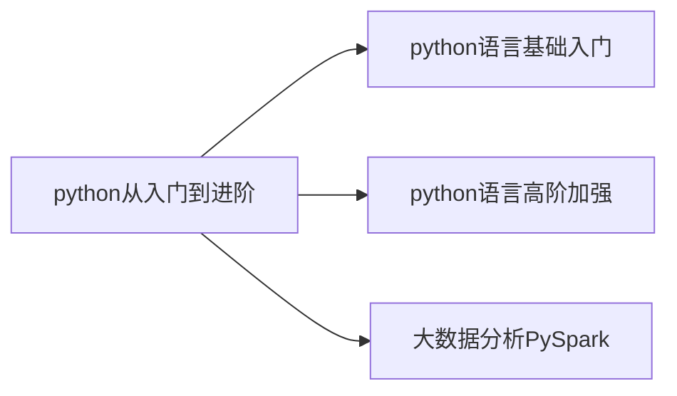

# python从入门到进阶

python从入门到进阶。
python简洁高效、应用场景丰富。

<!-- more -->


# 第一章
## 01 初始python
&ensp;&ensp;&ensp;&ensp;为什么选择python？
&ensp;&ensp;&ensp;&ensp;&ensp;&ensp;&ensp;&ensp;优雅、易学、开发效率高

## 02 什么是编程语言

&ensp;&ensp;&ensp;&ensp;语言：进行沟通交流的表达方式

&ensp;&ensp;&ensp;&ensp;编程语言是用于人类与计算机交流的一种语言，通过编写编程语言的代码，去指挥计算机工作。它无法直接与计算机沟通，需要翻译工具（解释器或编译器）将代码翻译为二进制，从而实现和计算机的顺畅沟通。

## 03 python环境安装（Windows）
&ensp;&ensp;&ensp;&ensp;下载python：python.org

## 04 python环境安装（MacOS）
略

## 05 python环境安装（Linux）
略

## 06 第一个python程序-Hello World

win+R --> cmd --> python
出现三个">>>"后就可以输入python代码了
双引号和括号都得是英文输入法下的符号。
```python
print("hello,world")
print("你好世界")
```

## 07 python解释器
    基本原理：计算机只认识二进制0和1.
python解释器是一个计算机程序，用来翻译python代码，并提交给计算机执行。
所以，它的功能就两个：翻译代码、提交给计算机执行。、

在命令窗口内直接敲代码只能执行一行，若要执行多行可以新建.py文件，再在命令窗口下输入：
```
C:\Users\22773>python C:\Users\22773\Desktop\pythonlearning\编程基础学习\test.py
hello world
```

## 08 PyCharm开发工具的安装和基础使用

