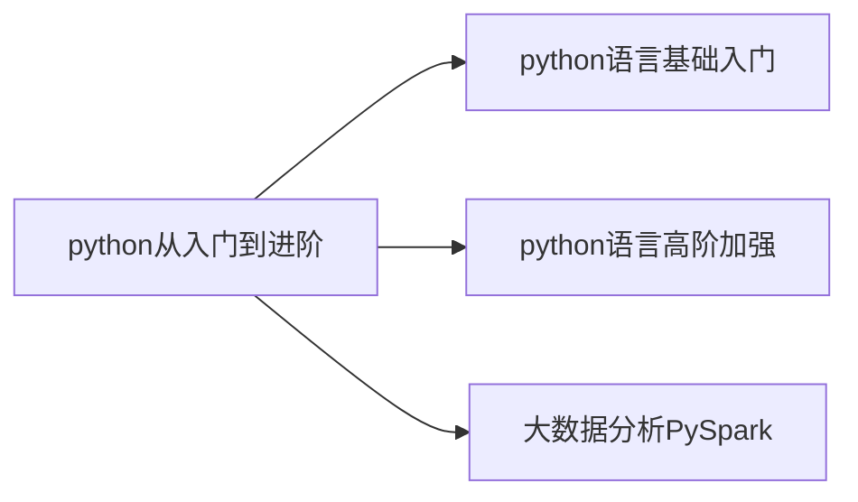

# python从入门到进阶

python从入门到进阶。
python简洁高效、应用场景丰富。

<!-- more -->




# 第一章 你好python
## 01 初始python
&ensp;&ensp;&ensp;&ensp;为什么选择python？
&ensp;&ensp;&ensp;&ensp;&ensp;&ensp;&ensp;&ensp;优雅、易学、开发效率高

## 02 什么是编程语言

&ensp;&ensp;&ensp;&ensp;语言：进行沟通交流的表达方式

&ensp;&ensp;&ensp;&ensp;编程语言是用于人类与计算机交流的一种语言，通过编写编程语言的代码，去指挥计算机工作。它无法直接与计算机沟通，需要翻译工具（解释器或编译器）将代码翻译为二进制，从而实现和计算机的顺畅沟通。

## 03 python环境安装（Windows）
&ensp;&ensp;&ensp;&ensp;下载python：python.org

## 04 python环境安装（MacOS）
略

## 05 python环境安装（Linux）
略

## 06 第一个python程序-Hello World

win+R --> cmd --> python
出现三个">>>"后就可以输入python代码了
双引号和括号都得是英文输入法下的符号。
```python
print("hello,world")
print("你好世界")
```

## 07 python解释器
    基本原理：计算机只认识二进制0和1.
python解释器是一个计算机程序，用来翻译python代码，并提交给计算机执行。
所以，它的功能就两个：翻译代码、提交给计算机执行。、

在命令窗口内直接敲代码只能执行一行，若要执行多行可以新建.py文件，再在命令窗口下输入：
```
C:\Users\22773>python C:\Users\22773\Desktop\pythonlearning\编程基础学习\test.py
hello world
```

## 08 PyCharm开发工具的安装
略

## 09 PyCharm的基础使用
1、修改pycharm的主题：
> 齿轮->主题

2、修改默认字体的大小
> 设置-编辑器-字体

3、设置快捷键快速设置字体大小
> 设置-按键映射

4、常用快捷键
> ctrl+d 复制当前行代码
> shift+alt+上/下 将当行代码上移或下移
> ctrl+shift+f10 运行当前代码文件
> shift+f6 重命名

# 第二章 基础语法
## 01 字面量

> 概念：在代码中，被**写下来的固定的值**，称之为**字面量**。

常用的值类型：
python中常用的有**6**种值（数据）类型
<table>
    <tr>
        <th>类型</th><th>描述</th><th>说明</th>
    </tr>
    <tr>
        <td rowspan="4">数字number</td><td>整数int</td><td>如：10，-10</td>
    </tr>
    <tr>
        <td>浮点数float</td><td>如：13.14</td>
    </tr>
    <tr>
        <td>复数complex</td><td>如：4+3j</td>
    </tr>
    <tr>
        <th>布尔bool</th><th>true 和 false</th>
    </tr>
    <tr>
        <th>字符串string</th><th>描述文本的一种数据类型（需要加上双引号或者单引号）</th><th>字符串由任意数量的字符组成</th>
    </tr>
    <tr>
        <th>列表list</th><th>有序的可变序列</th><th>python中使用最频繁的数据类型，可有序记录一堆数据</th>
    </tr>
    <tr>
        <th>元组tuple</th><th>有序的不可变序列</th><th>可有序记录一堆不可变的python数据集合</th>
    </tr>
    <tr>
        <th>集合set</th><th>无序不重复集合</th><th>可无序记录一堆不重复的python数据集合</th>
    </tr>
    <tr>
        <th>字典dictionary</th><th>无序key-value集合</th><th>可无序记录一堆key-value型的python数据集合</th>
    </tr>
</table>

## 02 注释
> 注释的作用:在程序代码中对程序代码进行解释说明的文字

> 单行注释：#开头
```python
# 我是注释
```
> 多行注释：用一对三个双引号引起来的内容
```python
"""我是注释
我可以换行
"""
```

## 03 变量
> 什么是变量？
>> 在程序运行时，能存储计算结果或者能表示值的抽象概念。

> 变量的定义格式：变量名称 = 值

```python
# 定义一个变量，用来记录钱包余额
money = 50
# 利用print语句打印出来
print("钱包还有：",money)
# 买了一个冰淇淋，花费10元
money = money - 10
print("钱包余额：",money,"元")
# 每隔一小时输出钱包的余额
print("现在是下午1点，钱包余额剩余：",money)
print("现在是下午2点，钱包余额剩余：",money)
print("现在是下午3点，钱包余额剩余：",money)
print("现在是下午4点，钱包余额剩余：",money)
```

## 04 数据类型
### 1、type()语句
使用方式：
1、在print语句中直接输出类型信息，代码示例如下：
```python
print(type(1.314))
print(type(1314))
print(type("我爱作者"))
"""
输出如下：
<class 'float'>
<class 'int'>
<class 'str'>
"""
```
2、用变量存储type()的结果（返回值）
```python
float_type = type(1.314)
int_type = type(1314)
string_type = type("我爱作者")
print(float_type)
print(int_type)
print(string_type)
"""
输出如下：
<class 'float'>
<class 'int'>
<class 'str'>
"""
```
3、type()语句还可以查看变量中存储的数据类型
```python
name = "柯锡荣"
name_type = type(name)
print(name_type)
"""
输出如下：
<class 'str'>
"""
```
<font color=#FF000 ><font size=5 >**type()查看的是变量存储的数据的类型，变量无类型，但是它存储的数据有**</font></font>

